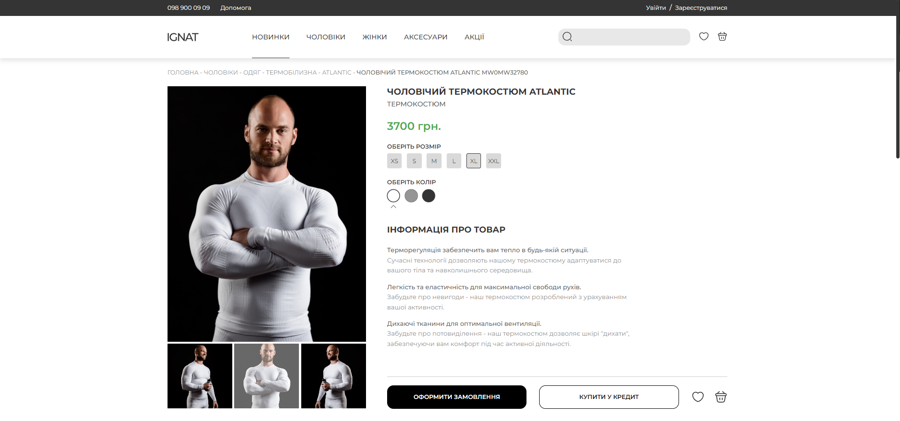

# IGNAT

**IGNAT - Front-end task for terms of reference**

### Documentation:
##### How to install and start:

1. git clone https://github.com/Zukicode/ignat-front-task
2. cd ignat-front-task
3. npm install
4. npm start

##### Folder Structure:

1. Assets
2. Components
	∟ App - general component
	∟ Header, Footer
	∟ MiniHeader, Header
	∟ Path 
	∟ Product
	∟ Reviews
	∟ Recommends
	∟ Contacts
3. Styles
4. Utils

##### Tech Stack:

1. React
2. SCSS / SCSS MODULES
